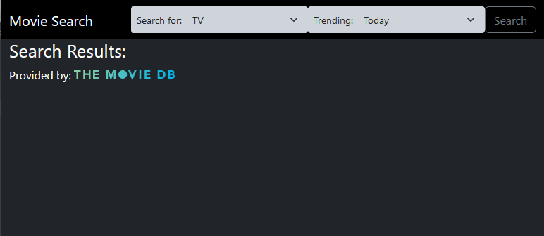
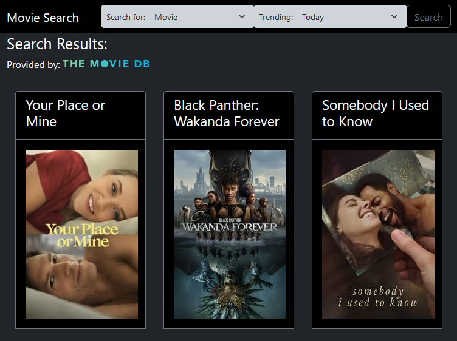
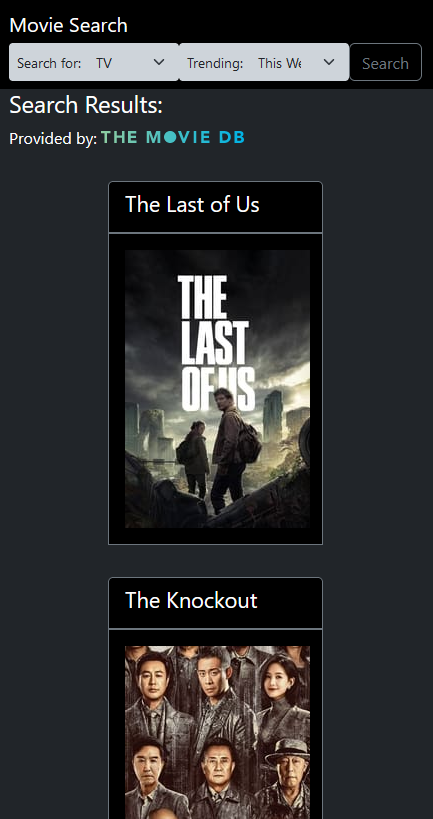

# TMDB-TrendingSearch
 A mobile-friendly webpage that utilizes TMDB's API to retrieve daily or weekly trends for movies, tv shows and people involved in the industry.

## Table of contents

- [Overview](#overview)
  - [The challenge](#the-challenge)
  - [Screenshots](#screenshots)
- [My process](#my-process)
  - [Built with](#built-with)
  - [What I learned](#what-i-learned)
  - [Continued development](#continued-development)
  - [Useful resources](#useful-resources)
- [Author](#author)
- [Acknowledgements](#acknowledgements)

## Overview

A small cog in a larger project; TMDB-TrendingSearch is the first entry in a series of pages that explore the functionality of The Movie DB API and provide me with the opportunity to learn more about various frameworks for frontend development. 

TMDB-TrendingSearch allows users to search for the weekly or daily trends in movies, tv shows and various people involved in the motion picture industry. 
### The challenge

Users should be able to:

- Filter trending between:
  - Today
  - This Week
- Search for:
  - Movies
  - TV Shows
  - People
  - ALL

### Screenshots

## My process

First, I reviewed the video from Andy's Tech Tutorials (link in resources) and combined that with my experience from the Mammoth Interactive tutorial projects to create the most barebones functioning webpage. I spent a long time messing around with learning to use more of Bootstrap 5's options in order to tweak the cards to a good shape. Thanks to The Net Ninja, I was able to figure out how to get interfaces into separate files by using modules, and they really helped me understand the errors regarding why JavaScript would run fine even though the TypeScript compiler would throw errors regarding what properties to expect from the json file. 

### Built with

- TypeScript
- Bootstrap 5
- TMDB API
- JSON
- VSCode & LiveServer
- GitHub (obviously)
- Trial and Error (ha)

### What I learned

- I learned how to better use Bootstrap to create cards quickly but cleanly, and in a manner that allows all of the cards to be identical in size. 
  - This is super finicky, but I'm getting the hang of it (Perhaps the next project I should use custom CSS with Bootstrap)
- How to use the TypeScript compiler for VSCode.
  - tsc -w combined with autosave is the best thing invented
- The importance of clearing the div container when a user issues another search.
  - Took longer than it should to realize this (ha)
- How to use GitHub's issues and project tracker to keep track of what I'm working on.
  - Seriously, this has already saved me so much headache for trying to remember what I need to do next

### Continued development

I've still got a few things that I want to do with the page before I move on to another project. Namely:
- Make the size of the title cards more uniform
  - Potentially truncate the longer titles and have a on-hover effect to reveal the full name
- On-click pop-in cards that reveal more information about the particular object
- Animated Hamburger menu to link to other relevant projects (and my evenutal portfolio)

### Useful resources

- [The Movie DB API Docs](https://www.themoviedb.org/documentation/api) - Very thorough documentation with more than enough information to get anyone started
- [The Movie Database API Tutorial - Andy's Tech Tutorials](https://www.youtube.com/watch?v=FlFyrOEz2S4) - Clear and concise explanations on how to use TMDB's API to create basic websites
- [TypeScript Tutorial - The Net Ninja](https://www.youtube.com/playlist?list=PL4cUxeGkcC9gUgr39Q_yD6v-bSyMwKPUI) - Amazing tutorial on the fundamentals of TypeScript

## Author

- Website - [GitHub/ravenloue](https://github.com/ravenloue)
- LinkedIn - [Brandie Mallard](https://www.linkedin.com/in/brandie-mallard-0554aa219/)
- Twitter - [@ravenloue](https://www.twitter.com/ravenloue)

## Acknowledgements

I was looking for some inspiration for a new project to further develop my skills, and many of the articles I read mentioned creating a webpage that connects to a movie database to pull information on movies onto cards. The one I originally looked at suggested IMDB (because of its familiarity, I presume), but when I looked into using the API, I couldn't find free access (perhaps I just overlooked it). However, when looking up videos on how to connect to IMDB, I came across a video by [Andy's Tech Tutorials](https://www.youtube.com/@AndysTechTutorials) on YouTube that demonstrated how to use The Movie DB's API, and thus my project had a foothold. 

Big thanks to [TMDB](https://www.themoviedb.org/) for allowing us developers have access to your API for non-commercial use at no cost, and for providing great documentation on the structure of the documents returned by each type of call. I've learned a lot so far, and I can't wait to continue on. 

Another big thank you to [The Net Ninja](https://www.youtube.com/@NetNinja) for their tutorial series on TypeScript. I had a bit of familiarity with it going in, but this series made a HUGE difference in the amount of time it took me to get the basics of this up and running. 